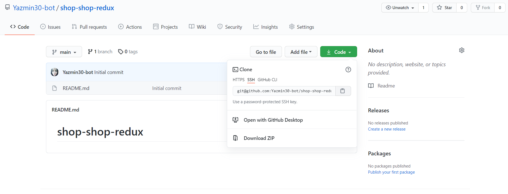
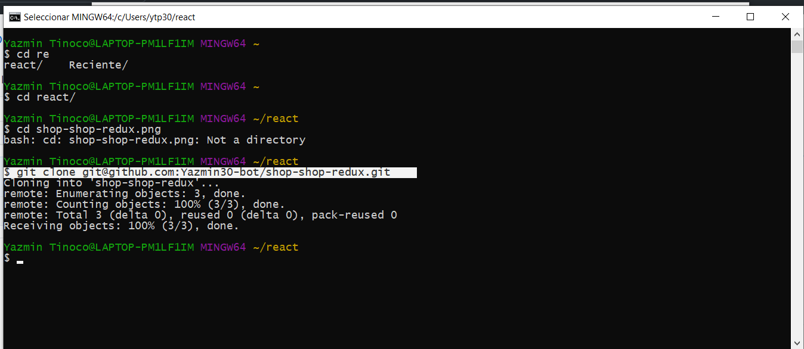

# shop-shop-redux

## Description
  
  This is an e-commerce platform app, which was built using the MERN stack with a React front end, MongoDB database, and Node.js/Express.js server and API. It uses [Redux](https://redux.js.org/) to to manage global state
  

  
  
## Table of Contents
  
  *[Installation](#installation)
  
  *[Usage](#usage)
  
  *[Build-With](#build-with)

  *[Links](#links)

  *[Author](#author)
  
  *[Contributing](#contributing)
  
  *[Questions](#questions)

## Installation
  * Go to the following link [https://github.com/Yazmin30-bot/shop-shop-redux](https://github.com/Yazmin30-bot/shop-shop-redux/) and clone it 
  * Go to Git-bash and page the github's with the following code
    ```
    $ git@github.com:Yazmin30-bot/shop-shop-redux.git
    ``` 
    
  

  * To install necessary dependencies, run the following command:
    ```
    npm install
    ```
## Usage

  * The application will be invoked by using the following command:

    ```bash
    npm run start:dev
    ```
  * The following animation demonstrates the application functionality.  
    
   
## Build with 
  * [Javascript](https://www.javascript.com/) - `Javascript`
  * [NodeJs](https://nodejs.org/en/) - `NodeJs`
  * [MongoDB](https://nodejs.org/en/) - `MongoDB`
  * [Express](https://nodejs.org/en/) - `Express`
  * [React](https://nodejs.org/en/) - `React`
  * [Redux](https://redux.js.org/) - `Redux`

## Links
  * The URL of the deployed application.
  [https://peaceful-springs-21820.herokuapp.com/](https://pure-ravine-25420.herokuapp.com/)
  * The URL of the GitHub repository.                                         [https://github.com/Yazmin30-bot/googlebooks-app/](https://github.com/Yazmin30-bot/shop-shop-redux/)

## Author 
  * **`Yazmin Tinoco`**   - [Yazmin30-bot](https://github.com/Yazmin30-bot/)

## Contributing
  Pull requests are welcome. For major changes, please open an issue first to discuss what you would like to change. 


  
## Questions
  If you have any questions about the repo, open an issue or contact me directly at ytip30@gmail.com.
  You can find more of my work at [Yazmin30-bot](https://github.com/Yazmin30-bot/). 